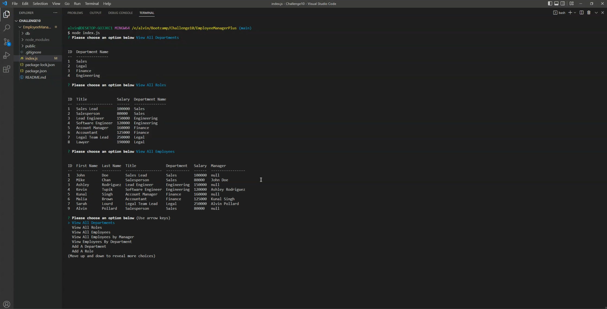
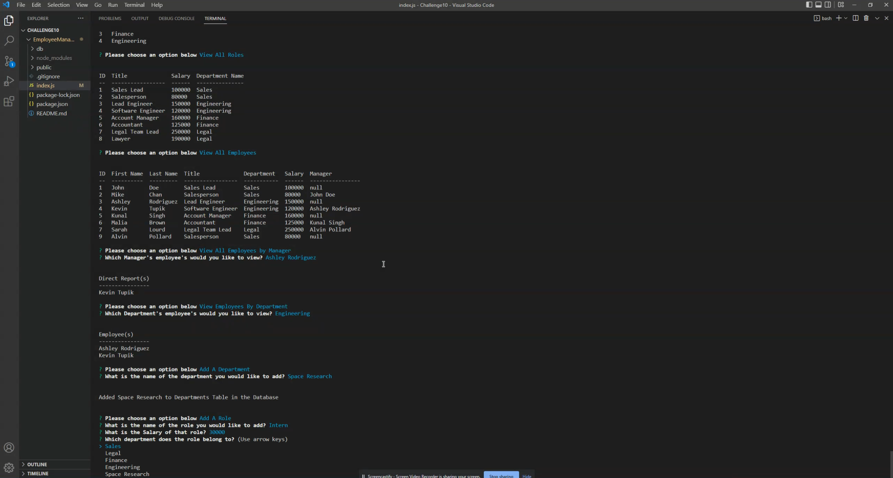

# Employee Manager Plus

This was the Tenth challenge assignment for our UPENN Bootcamp. We were tasked with creating an Employee Tracker that works in the command-line. (See **User Story** and **Acceptable Criteria** sections below).

---

## 📕 User Story 

AS A business owner I WANT to be able to view and manage the departments, roles, and employees in my company SO THAT I can organize and plan my business

---

## ✔️ Acceptable Criteria 

- GIVEN a command-line application that accepts user input
- WHEN I start the application THEN I am presented with the following options: view all departments, view all roles, view all employees, add a department, add a role, add an employee, and update an employee role
- WHEN I choose to view all departments THEN I am presented with a formatted table showing department names and department ids
- WHEN I choose to view all roles THEN I am presented with the job title, role id, the department that role belongs to, and the salary for that role
- WHEN I choose to view all employees THEN I am presented with a formatted table showing employee data, including employee ids, first names, last names, job titles, departments, salaries, and managers that the employees report to
- WHEN I choose to add a department THEN I am prompted to enter the name of the department and that department is added to the database
- WHEN I choose to add a role THEN I am prompted to enter the name, salary, and department for the role and that role is added to the database
- WHEN I choose to add an employee THEN I am prompted to enter the employee’s first name, last name, role, and manager, and that employee is added to the database
- WHEN I choose to update an employee role THEN I am prompted to select an employee to update and their new role and this information is updated in the database 

---

## 🔧 Optimizations 

### Javascript
- Allows user to Add, View and Remove Employees
- Allows user to Add, View and Remove Roles
- Allows user to Add, View and Remove Departments
- Uses the MySQL2 & Inquirer npm module
- Allows user to see budgets by departments

---

## 📷 Screenshots 

---

## 🎯 Deployment

Repository: https://github.com/alvinkp/EmployeeManagerPlus

Video Walkthrough: https://drive.google.com/file/d/149TMTPXcAcVOa9WCb-Zay9RLv2A23PoW/view

---

## ✉️ Authors 

- [@alvinkp](https://www.github.com/alvinkp)